# Alyasen System Database ERD

## Overview

This ERD represents the database schema for the Alyasen management system.

## Mermaid ERD Diagram

```mermaid
erDiagram
    USER ||--|| PROFILE : "1:1"
    USER {
        uuid uuid PK
        string name
        string username
        string email
        boolean email_verified
        integer otp
        datetime otp_created_at
        date created_date
        datetime last_login
        boolean is_approvid
        string user_type
    }
    PROFILE {
        int id PK
        int user_id FK
        string reset_password_token
        datetime reset_password_expire
    }

    CLIENT ||--o{ CLIENT_PROJECT_BALANCE : "1:N"
    CLIENT {
        int id PK
        string name
        string phone
        string email
        float total_balance_owed_to_us
        float total_remaining_balance_owed_to_us
        float total_paid_amount
        image profile_picture
    }

    SUPPLIER ||--o{ SUPPLIER_PROJECT_BALANCE : "1:N"
    SUPPLIER ||--o{ CAMPAINE_ITEM : "1:N"
    SUPPLIER ||--o{ MATERIALS_SUPPLIERS : "1:N"
    SUPPLIER ||--o{ SUPPLIER_PROJECT_PAYMENT : "1:N"
    SUPPLIER {
        int id PK
        string name
        string phone
        string email
        float total_amount_due
        float total_amount_payable
        float total_paid_amount
        image profile_picture
    }

    BASE_PROJECT ||--o| RENT_PROJECTS : "1:1"
    BASE_PROJECT ||--o| SELLING_INDUSTRIAL_DETAILS : "1:1"
    BASE_PROJECT ||--o{ CLIENT_PROJECT_BALANCE : "1:N"
    BASE_PROJECT ||--o{ SUPPLIER_PROJECT_BALANCE : "1:N"
    BASE_PROJECT ||--o{ CAMPAINE_ITEM : "1:N"
    BASE_PROJECT ||--o{ PROJECT_CONTRACTS : "1:N"
    BASE_PROJECT ||--o{ GUARANTEE_CHEQUES : "1:N"
    BASE_PROJECT {
        int id PK
        string name
        string project_type
        int client_id FK
        string project_status
        float cost
        int supplier_id FK
        date created_date
    }

    RENT_PROJECTS ||--o{ RENT_OPERATING_COST : "1:N"
    RENT_PROJECTS ||--o{ RENT_PROJECT_CONTRACTS : "1:N"
    RENT_PROJECTS ||--o{ PROJECT_RENTAL_ADS : "1:N"
    RENT_PROJECTS {
        int id PK
        int project_id FK
        float operating_costs
        string project_status
        float value_added_tax
        float insurance_tax
        date insurance_tax_date
        float commercial_profits_tax
        float total_cost
        float net_profit
        float selling_price
    }

    RENT_OPERATING_COST {
        int id PK
        int project_id FK
        string name
        float amount
    }

    RENT_PROJECT_CONTRACTS {
        int id PK
        int project_id FK
        file contract
    }

    PROJECT_RENTAL_ADS {
        int id PK
        int project_id FK
        string ad_type
        int number
        string size
        string address
        text notes
    }

    SELLING_INDUSTRIAL_DETAILS ||--o{ INDUSTRIAL_OPERATING_COST : "1:N"
    SELLING_INDUSTRIAL_DETAILS ||--o{ MATERIALS_SUPPLIERS : "1:N"
    SELLING_INDUSTRIAL_DETAILS ||--o{ INDUSTRIAL_CONTRACTS : "1:N"
    SELLING_INDUSTRIAL_DETAILS {
        int id PK
        int project_id FK
        float total_cost
        float total_materials_cost
        float profit
        float operating_costs
        float value_added_tax
        float insurance_tax
        date insurance_tax_date
        float profits_tax
    }

    INDUSTRIAL_OPERATING_COST {
        int id PK
        int project_id FK
        string name
        float amount
    }

    MATERIALS_SUPPLIERS ||--o{ MATERIALS_PAYMENTS : "1:N"
    MATERIALS_SUPPLIERS {
        int id PK
        int project_id FK
        string name
        string phone
        string material_name
        float price
        float quantity
    }

    MATERIALS_PAYMENTS {
        int id PK
        int m_supplier_id FK
        float amount
        date date
    }

    INDUSTRIAL_CONTRACTS {
        int id PK
        int project_id FK
        file contract
    }

    PROJECT_CONTRACTS {
        int id PK
        int project_id FK
        file contract
    }

    GUARANTEE_CHEQUES {
        int id PK
        int project_id FK
        string cheque_number
        date cheque_date
        float cheque_amount
    }

    CLIENT_PROJECT_BALANCE ||--o{ CLIENT_PAYMENT : "1:N"
    CLIENT_PROJECT_BALANCE {
        int id PK
        int client_fk_id FK
        int project_fk_id FK
        int campaine_fk_id FK
        string project_type
        float total
        float paid
        float remining
    }

    CLIENT_PAYMENT {
        int id PK
        int balance_id FK
        string portal_invoice_number
        file portal_invoice_file
        float payment_amount
        date payment_date
        string payment_type
        date check_cleared_date
        boolean is_cleared
        text notes
    }

    SUPPLIER_PROJECT_BALANCE ||--o{ SUPPLIER_PROJECT_PAYMENT : "1:N"
    SUPPLIER_PROJECT_BALANCE {
        int id PK
        int supplier_fk_id FK
        int project_fk_id FK
        float total
        float paid
        float remining
    }

    SUPPLIER_PROJECT_PAYMENT {
        int id PK
        int supplier_fk_id FK
        int project_fk_id FK
        string portal_invoice_number
        file portal_invoice_file
        float payment_amount
        date payment_date
        text notes
    }

    CAMPAINE ||--o{ CAMPAINE_ITEM : "1:N"
    CAMPAINE ||--o{ CLIENT_PROJECT_BALANCE : "1:N"
    CAMPAINE ||--|| CLIENT : "N:1"
    CAMPAINE {
        int id PK
        string name
        int client_id FK
        float total_cost
        date created_date
    }

    CAMPAINE_ITEM {
        int id PK
        int campaine_id FK
        int supplier_id FK
        int project_id FK
    }

    SAFE ||--o{ SAFE_LOGS : "1:N"
    SAFE {
        int id PK
        float balance
    }

    SAFE_LOGS {
        int id PK
        text transaction
        datetime date
    }

    COMPANY_ASSETS ||--o{ ASSET_ATTACHMENTS : "1:N"
    COMPANY_ASSETS {
        int id PK
        string name
        float price
    }

    ASSET_ATTACHMENTS {
        int id PK
        int asset_id FK
        file file
    }

    QUOTATIONS ||--o{ QUOTATION_ATTACHMENTS : "1:N"
    QUOTATIONS {
        int id PK
        string client_name
        string company_name
        float price
        text details
        date quotation_last_date
        datetime created_date
    }

    QUOTATION_ATTACHMENTS {
        int id PK
        int quotation_id FK
        file attachment
    }

    EXPENSES {
        int id PK
        text transaction
        string permit_number
        float amount
        date created_date
        text notes
    }

    TRANSACTIONS_LOG {
        int id PK
        string username
        text transaction
        date created_date
    }

    NOTIFICATION {
        int id PK
        uuid uuid
        string title
        text message
        boolean is_read
        datetime created_at
    }
```

## Table Summary

| Table | Description | Key Fields |
|-------|-------------|------------|
| **User** | System users (Admin, Accountant) | uuid PK, username |
| **Profile** | User profile info (password reset) | user_id FK |
| **Client** | Customer/client records | id PK |
| **Supplier** | Vendor/supplier records | id PK |
| **BaseProject** | Core project table | id PK, project_type |
| **RentProjects** | Rental project details | project_id FK |
| **SellingIndustrialProjectDetails** | Industrial project details | project_id FK |
| **ClientProjectBalance** | Client payment tracking | client_fk, project_fk, campaine_fk |
| **ClientProjectPayment** | Individual client payments | balance_id FK |
| **SupplierProjectBalance** | Supplier payment tracking | supplier_fk, project_fk |
| **SupplierProjectPayment** | Individual supplier payments | supplier_fk FK |
| **Campaine** | Marketing campaigns | id PK, client FK |
| **CampaineItem** | Campaign line items | campaine FK, supplier FK, project FK |
| **Safe** | Company safe/treasury | id PK |
| **SafeLogs** | Safe transaction history | id PK |
| **CompanyAssets** | Fixed assets inventory | id PK |
| **CompanyAssetsAttachments** | Asset documents | asset FK |
| **Quotations** | Sales quotations | id PK |
| **QuotationsAttachments** | Quotation documents | quotation FK |
| **Expenses** | Company expenses | id PK |
| **TransactionsLog** | User activity log | id PK, username |
| **Notification** | System notifications | uuid |

## Key Relationships

1. **Client → Project**: Through BaseProject.client FK (many projects per client)
2. **Supplier → Project**: Through BaseProject.supplier FK (many projects per supplier)
3. **BaseProject → RentProjects**: One-to-One (project_type='rent')
4. **BaseProject → SellingIndustrialProjectDetails**: One-to-One (project_type='industrial')
5. **Client → Campaine**: One-to-Many
6. **Campaine → BaseProject**: Through CampaineItem (many-to-many)
7. **ClientProjectBalance**: Links Client, Project, and Campaine with payment tracking
8. **SupplierProjectBalance**: Links Supplier and Project with payment tracking

## Entity Relationship Notes

- `BaseProject` uses Single Table Inheritance pattern with `project_type` discriminator
- `RentProjects` and `SellingIndustrialProjectDetails` extend `BaseProject` via 1:1 relationship
- `ClientProjectBalance` supports both projects and campaigns via polymorphic relationship
- All balance tables track `total`, `paid`, and `remining` for accounting
